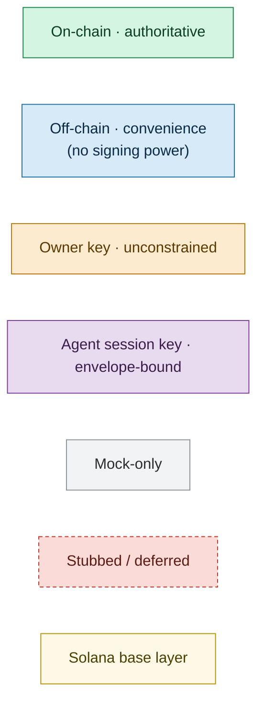
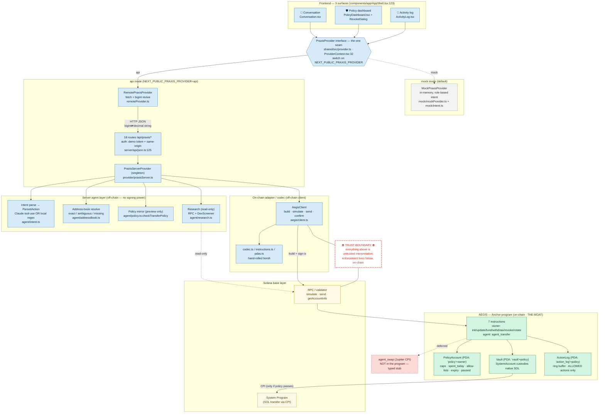
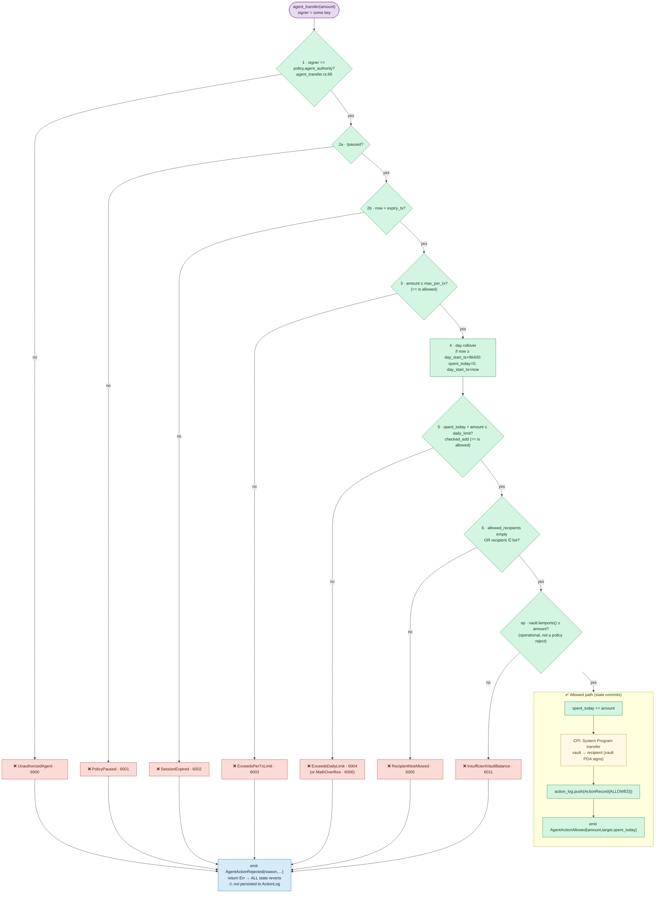
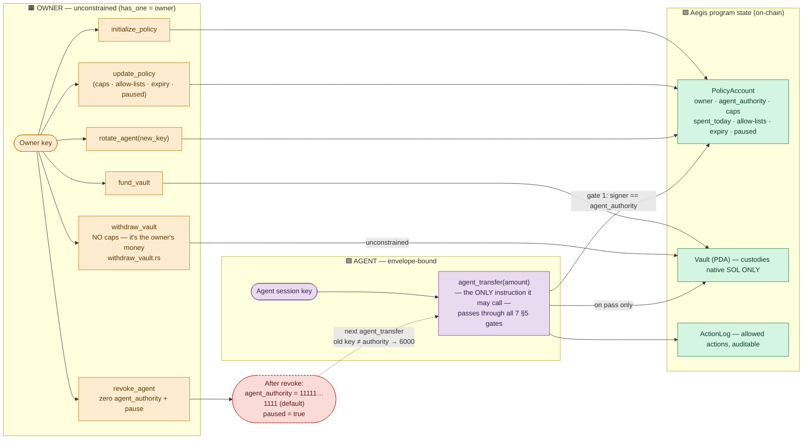
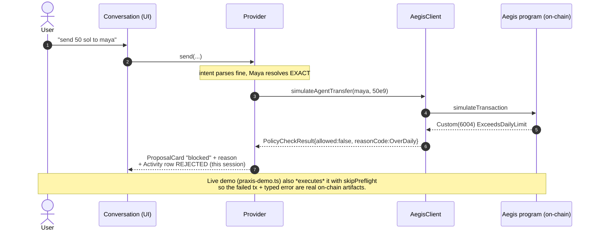
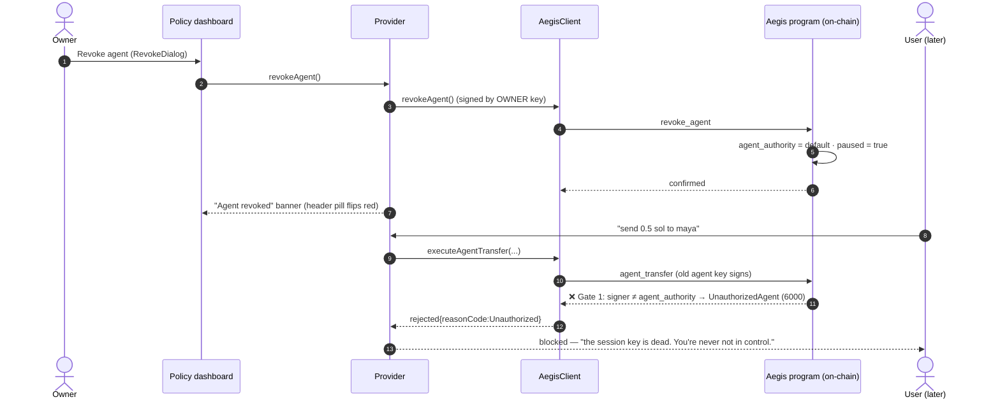
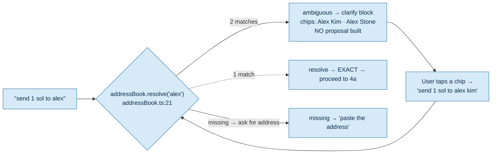
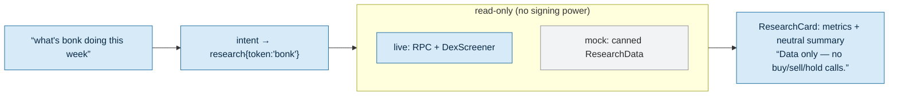
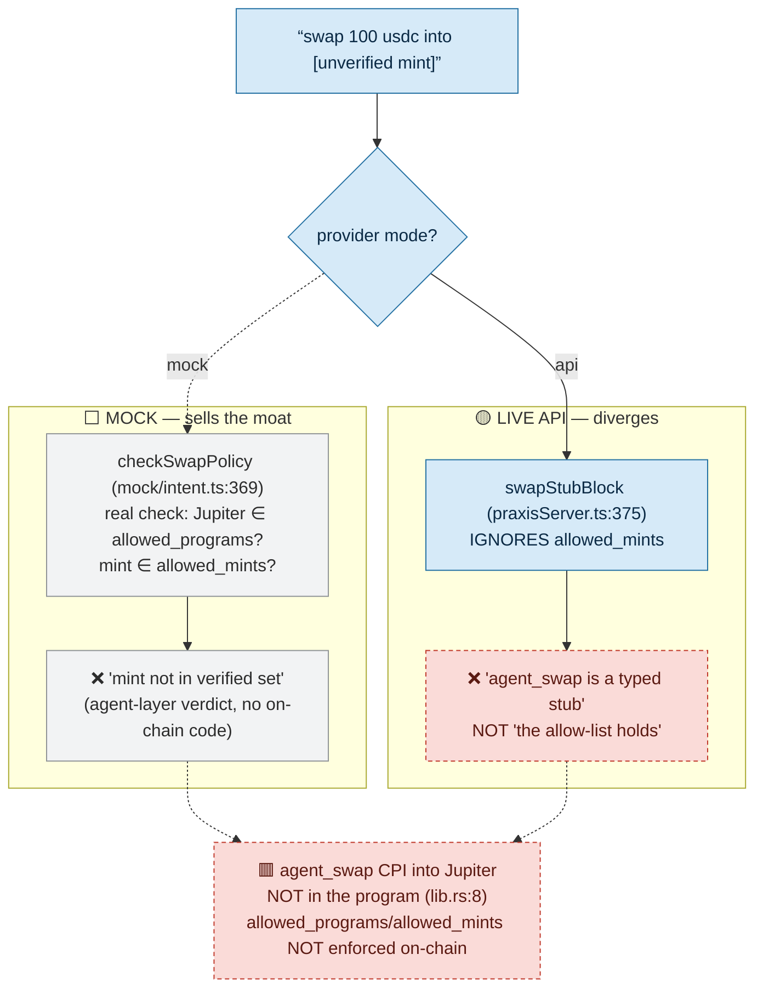
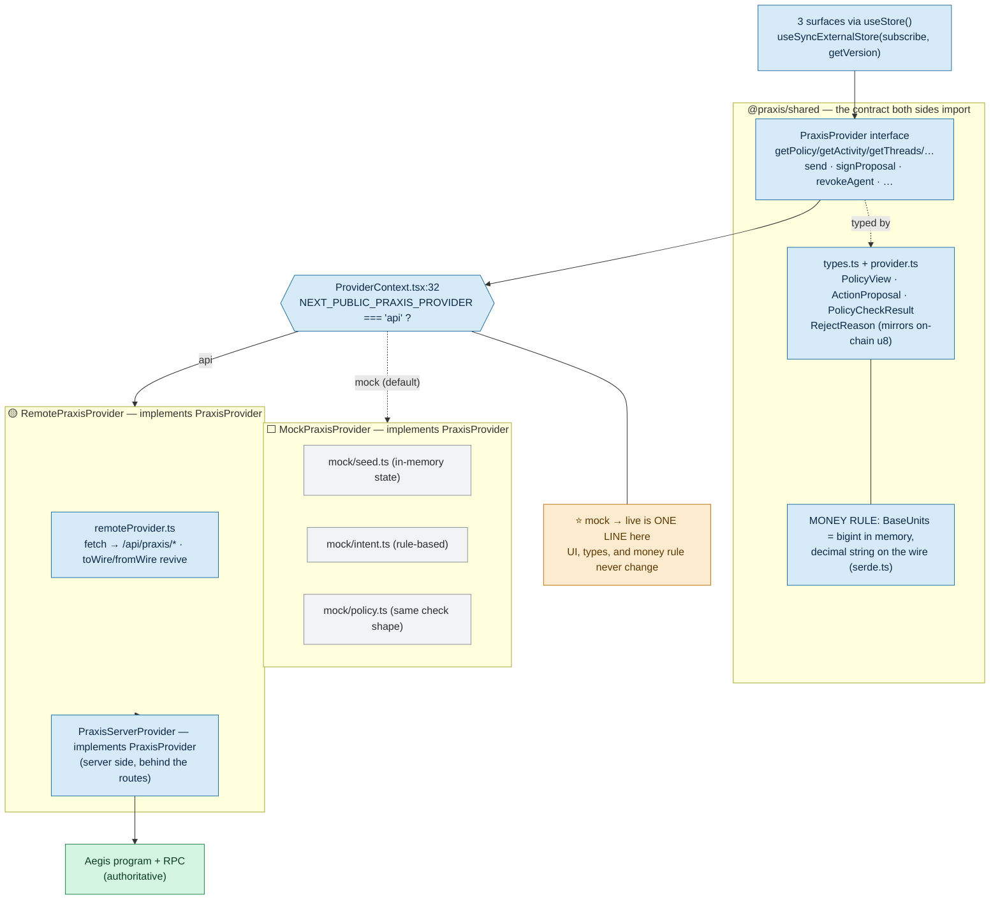

# Praxis — Visual Architecture (as built)

> **What this is.** A picture of the system that *actually ships in this repo* — not the
> idealized spec. Where the spec (`praxis-product-capstone-spec.md`) and the audit
> (`STATUS.md`) disagree, the audit wins, and the divergence is drawn, not hidden.
> Honesty is the product, so honesty is the point of these diagrams.
>
> **How it was verified.** Every box and arrow below was checked against a real file
> (cited inline as `path:line`). The Aegis program logic is unit-proven on LiteSVM
> (`bun run aegis:test` — 6/6 green); the live `TS → RPC → program` round-trip is
> code-complete but **has not been run against a cluster** in the audit, so anything that
> only happens over real RPC is marked *built-but-unverified-live*, never *live*.

---

## Legend — the encoding used in every diagram

The whole product is "delegated action without delegated trust," so the diagrams are
colour-coded by **where authority lives** and **how real the path is**.

| Encoding | Meaning |
|---|---|
| 🟩 **On-chain (authoritative)** | Enforced by the Aegis Anchor program / Solana consensus. Cannot be bypassed by compromising the LLM or backend. |
| 🟦 **Off-chain (convenience)** | Backend / frontend logic. Has **no signing power**; mirrors or previews the on-chain rule but is never the source of truth. |
| 🟧 **Owner authority (unconstrained)** | The owner key. Deposit, withdraw, change policy, revoke/rotate — no caps apply. |
| 🟪 **Agent session key (envelope-bound)** | The scoped signer. Can *only* call `agent_transfer`, and only within the policy. |
| ⬜ **Mock-only** | Behaviour that exists only in the in-memory mock provider (standalone demo). |
| 🟥 **Stubbed / deferred** | Intentionally not built (dashed border): `agent_swap` CPI, on-chain `allowed_programs`/`allowed_mints` enforcement, durable on-chain rejection records. |
| 🟨 **Solana base layer** | System Program / RPC the program builds on. |

Status shorthand used in text: **✅ live & verified** · **🟡 built, not run on a cluster** ·
**⬜ mock-only** · **🟥 stubbed**.



---

## 1. System architecture — the real layered system

The system is four layers: **three surfaces** → **one swappable provider seam** →
(in API mode) **the server agent layer + Aegis adapter** → **the Aegis program** →
**Solana**. The only thing with signing authority is the program. Everything above the
program is an *interpreter*; the program is the *executor*.

The dashed red **trust boundary** is the key idea: cross it from above with a malicious
prompt, a buggy parse, or a fully compromised backend, and the envelope still holds —
because enforcement lives *below* the boundary, on-chain.



**Reading notes (verified):**
- The mock side is a *complete second implementation* of `PraxisProvider`, not a fixture —
  it runs its own rule-based intent parser and its own policy check
  (`mock/intent.ts`, `mock/policy.ts`). It never touches the network. **All five demo
  moments are walkable on mock today.**
- In API mode the client holds the **agent keypair** and signs `agent_transfer`; it holds
  the **owner keypair** too in this demo build (see §3 honesty note). The program does not
  care who holds the keys — it checks the *signer* on-chain.
- `allowed_programs` / `allowed_mints` are **stored** on `PolicyAccount` but **not enforced
  by `agent_transfer`** (`state.rs:32-36`). Only the *recipient* allow-list is enforced
  on-chain. The mint allow-list is an off-chain agent-layer check (see §4b / §4e).

---

## 2. Aegis enforcement sequence — the moat, in exact order

This is the pitch. An `agent_transfer(amount)` arrives at the program and runs the spec
§5 gate **in this exact order** (`agent_transfer.rs:60-160`). Each gate has its own typed
error (codes `6000–6006`), and on rejection the program emits `AgentActionRejected` and
returns `Err`, which **reverts all account state** — so a rejection is *never* written to
the on-chain `ActionLog` (it lives only in the failed tx's logs). Boundary cases are
inclusive: `amount == max_per_tx` and `spent_today + amount == daily_limit` are **allowed**.



**Verified facts:** the order, the inclusive boundaries, the `checked_add` overflow guard,
and the "rejections revert and are not logged on-chain" property are all in
`agent_transfer.rs` and `state.rs:75-95`. The five non-negotiable test scenarios
(over-cap, exact boundary, intruder signer, revoke, allow-list) pass on a clean rebuild
(`STATUS.md` T1–T6). The error codes are mirrored to TypeScript in
`server/aegis/constants.ts:43` and `shared/src/types.ts:35`.

---

## 3. Trust & authority boundary — who can do what

Two keys, one program. The **owner** is unconstrained; the **agent** is envelope-bound and
can call exactly one instruction. The vault custodies only native SOL. Revoke kills the
agent at the very first gate.



**What revoke/rotate kills (verified `revoke_agent.rs` + STATUS T4):** revoke zeroes
`agent_authority` to the default pubkey *and* pauses. The next `agent_transfer` from the
old key fails at **gate 1** (signer ≠ authority → `6000`) — it doesn't even reach the
pause check. One owner tx, instant, on-chain.

> ### ⚠️ Honesty note — key custody in *this* build
> The spec's manifesto says "won't hold your keys / non-custodial to the owner." That is
> the **production goal, not the current build.** Today the **server holds both the agent
> keypair and the owner keypair** (`server/env.ts:99-101`,
> `requireOwnerKeypair`/`requireAgentKeypair`); owner mutations (revoke, update, fund,
> withdraw) are signed server-side. There is **no wallet adapter** wired. API-mode
> mutations are gated only by a shared **demo token + same-origin** check
> (`server/api/json.ts:125`). So in the live demo the trust boundary protects against a
> *compromised LLM/parse*, but **not** against a compromised backend that holds the owner
> key. Wallet/session auth is the documented production gap (`STATUS.md §5`).

---

## 4. User journeys — the §9 demo moments, end to end

Each flow runs `input → intent → resolution → simulate → policy verdict → sign/confirm or
reject → activity log`. Where **mock and live API diverge**, the divergence is drawn.

### 4a. Successful send to a saved name — "within your limit" ✅ mock / 🟡 live

`send 0.5 sol to maya` → resolves Maya → simulates → passes the policy → signs → confirms.

```mermaid
sequenceDiagram
  autonumber
  actor U as User
  participant FE as Conversation (UI)
  participant P as Provider
  participant AG as Intent + AddressBook (off-chain)
  participant CL as AegisClient (off-chain)
  participant AE as Aegis program (on-chain)

  U->>FE: "send 0.5 sol to maya"
  FE->>P: send(threadId, text)
  P->>AG: parse intent → transfer{0.5 SOL, "maya"}
  AG->>AG: resolve "maya" → EXACT (Maya Patel)
  P->>CL: simulateAgentTransfer(maya, 0.5e9)
  CL->>AE: simulateTransaction(agent_transfer)
  Note over CL,AE: off-chain mirror (policy.ts) + on-chain sim agree:<br/>allowed · "within 5 SOL daily; 4.5 remaining after"
  AE-->>CL: sim ok
  CL-->>P: PolicyCheckResult{allowed:true}
  P-->>FE: ProposalCard (pending, green PolicyCheckBanner)
  U->>FE: Sign
  FE->>P: signProposal(id)
  P->>CL: executeAgentTransfer(maya, 0.5e9)
  CL->>AE: send agent_transfer
  AE->>AE: 7 gates pass → spent_today += 0.5 → CPI vault→Maya → log ALLOWED
  AE-->>CL: confirmed (sig)
  CL-->>P: status "confirmed"
  P-->>FE: Proposal "signed" + Activity row ALLOWED (on-chain)
```

### 4b. Over-cap send the chain rejects — "the chain says no" ✅ mock / 🟡 live

`send 50 sol to maya`. With the seed envelope (`max_per_tx = 50`, `daily_limit = 5`,
`spent_today = 0`), 50 SOL **passes** the per-tx gate (50 ≤ 50) and **fails the daily
gate** → typed `ExceedsDailyLimit (6004)`. The agent wanted to; the chain wouldn't.
(`scripts/praxis-demo.ts` lands this failing tx with `skipPreflight` to read the real
on-chain error; `seed.ts:82` / demo policy confirm the numbers.)



> **Honesty:** gate 50 SOL is rejected by **OverDaily (6004)**, not OverPerTx — because the
> per-tx cap (50) is generous and the *daily* cap (5) is the binding constraint in the
> seed. The rejected Activity row is reconstructed from the typed error and held in
> **session memory**; it is *not* a durable on-chain record (rejections revert — see §2).

### 4c. Owner revokes → next agent action dies at the signer check ✅ mock / 🟡 live



### 4d. Ambiguous name → the agent asks instead of guessing ✅ both

`send 1 sol to alex` — two saved "alex" contacts (Kim & Stone, `seed.ts:57` /
`env.ts:31`). Resolution returns `ambiguous`; the agent renders a **clarify** block with
chips and **never builds a transaction** until disambiguated (spec §12.ii).



### 4e. Read-only research → data, no advice ✅ both (real RPC live)

`what's bonk doing this week` → distilled on-chain + market data, explicitly **no
buy/sell/hold call** (spec §12.iv). Live: real RPC (`getTokenLargestAccounts`,
`getTokenSupply`) + DexScreener (`agent/research.ts`). Mock: canned (`mock/intent.ts:433`).
**Zero signing path — never touches the program or a key.**



### 4f. The swap allow-list — where mock and live genuinely DIVERGE 🟥

The spec's §9 #3 money-shot ("swap into an unverified mint → allow-list rejects") behaves
**differently** on mock vs live, and `agent_swap` is **not on-chain at all**.



> **Two honest caveats on this one moment:**
> 1. **Even on mock, the mint allow-list is an *off-chain* (agent-layer) check** — there is
>    no on-chain `RejectReason` for it. The only allow-list `agent_transfer` enforces
>    on-chain is the **recipient** list. So "the chain rejects an unverified mint" is the
>    spec's aspiration; the *built* truth is "the agent layer rejects it, and `agent_swap`
>    isn't on-chain yet."
> 2. **Live API does not reproduce the mock behaviour.** `swapStubBlock` returns "not
>    implemented" and never runs `allowed_mints`. To make #3 faithful in API mode, the
>    server would run the same `checkSwapPolicy` before the stub message (`STATUS.md §3.1`,
>    ~20 lines). Until then, a judge running API mode sees a different result than the mock.

---

## 5. The provider seam — one interface, two backends

`PraxisProvider` (`shared/src/provider.ts`) is the *entire* contract between the UI and its
data. The UI imports the interface and the shared types — never a concrete implementation.
`ProviderContext.tsx` is the **single swap point**: one env var picks the in-memory mock or
the HTTP-backed remote. Both sides agree by construction because they share
`@praxis/shared` types, and money crosses the wire under one rule.



**Verified:** both `MockPraxisProvider` and `PraxisServerProvider` declare
`implements PraxisProvider`. The wire codec stringifies every `bigint` and the client
re-hydrates by money-key name (`remoteProvider.ts:227-265`, `server/api/json.ts:160`), so
type shapes agree by construction. The switch is genuinely one env-var line
(`ProviderContext.tsx:32`).

> **Seam caveats (`STATUS.md §3`):** API mode does **not** silently fall back to mock — a
> missing backend shows an error screen (`AppShell.tsx:42`), which is the honest choice.
> `subscribe` advertises a poll transport but the remote provider only refreshes **after a
> mutation** (no live polling loop). And API mode has real prerequisites not wired by
> default: deployed program, initialized policy, funded vault, owner+agent keypairs, RPC,
> and either `ANTHROPIC_API_KEY` or `PRAXIS_LOCAL_INTENT=1`.

---

## Appendix — what I inferred vs. confirmed

**Confirmed from code** (the overwhelming majority): every instruction, account, PDA seed,
the enforcement order and inclusive boundaries, error codes and their TS mirror, the
provider interface and its two implementations, the env-var swap point, the money/wire
rule, the address-book resolution outcomes, the swap stub, the owner+agent key custody, and
the demo-token/same-origin mutation gate.

**Inferred (not directly executed in this pass), flagged honestly:**
- The **live `TS → RPC → program` round-trip** is read-correct but **unverified against a
  cluster** — every 🟡 path (4a, 4b live, 4c, research live). The program itself is proven
  on LiteSVM only.
- In **4c**, that the post-revoke failure lands on **gate 1 (6000)** rather than the pause
  gate (6001) is inferred from the gate ordering (signer is checked before paused) and is
  corroborated by `STATUS.md` T4 ("old key → 6000"); not separately executed here.
- **Real Claude intent parsing** and **real DexScreener/RPC research responses** were not
  exercised (no API key / network in the audit); the request/response shapes look correct.
- The `refreshActivity` dead ternary (`praxisServer.ts:83`,
  `kind === Transfer ? "transfer" : "transfer"`) is a latent cosmetic bug noted in
  `STATUS.md §4.4`; harmless today because no swap kind is ever written on-chain.
